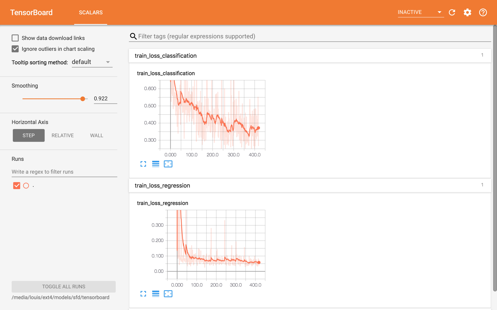

# sfd.pytorch
sfd implementation for face recognition in pytorch. Paper at: [SFD: Single Shot Scale-invariant Face Detector](https://arxiv.org/abs/1708.05237)

## Requirements

* Python 3.6
* Pytorch 0.4

## TODOs

- [x] Training on wider faces.
- [x] Inference tools and API.
- [x] Non-maximum suppression at reference.
- [x] Tensorboard supported.
- [ ] Evaluation.
- [ ] Image augmentation.
- [ ] Multi-class detection.
## Detection

The `detector.py` is executable and programmable, see `inference.ipynb` for a quick look at how to use the detector API. Using the following command for directly use it in the command line.

```
python3 detector.py --image ./image/test.jpg --model ./epoch_41.pth.tar
```

The trained model `epoch_41.pth.tar` can be downloaded from [Baidu Yun](https://pan.baidu.com/s/1hC0GJh98UPZMrNhI_8jbVg) or [Google Drive](https://drive.google.com/open?id=1d8J_GWdez-AZ3oHifmOgKkr8ljWudy2D).

The detector will draw bounding boxes and the result is showing bellow


## Train

To train with the [wider_face dataset](http://mmlab.ie.cuhk.edu.hk/projects/WIDERFace/), download and extract everything in one directory named `wider_face`. The file trees should then look like this,
```
└── wider_face
    ├── Submission_example.zip
    ├── wider_face_split
    │   ├── readme.txt
    │   ├── wider_face_test_filelist.txt
    │   ├── wider_face_test.mat
    │   ├── wider_face_train_bbx_gt.txt
    │   ├── wider_face_train.mat
    │   ├── wider_face_val_bbx_gt.txt
    │   └── wider_face_val.mat
    ├── wider_face_split.zip
    ├── WIDER_test
    │   └── images
    ├── WIDER_test.zip
    ├── WIDER_train
    │   └── images
    ├── WIDER_train.zip
    ├── WIDER_val
    │   └── images
    └── WIDER_val.zip
```
In the `config.py`, set the `DATASET_DIR` to the path of `wider_face`, and set the `LOG_DIR` to whatever but a existed directory. Now it's ready to train with the following command,

```
python3 main.py # there is no stdout
```

The training log is in `LOG_DIR/log.txt`, and models will be saved at `LOG_DIR/models/epoch_xx.pth`. There are many options in `config.py`(including learning rate or resumption) for you to tweak to get a better model.

If you set `TENSOR_BOARD_ENABLED` to True in the `config.py`, you can use the following command to quickly start the tensorboard server.

```
./bin/tensorboard
```

Now we can visualize how the loss is changing

